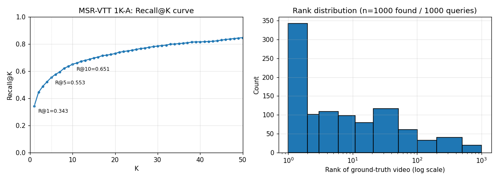

# Evaluation

Retrieval quality measurements against published benchmarks. Numbers here are reproducible from the repo via `make fetch-msrvtt` → `make ingest-msrvtt` → `make eval`.

## MSR-VTT 1K-A — text → video retrieval

The standard 1K-A protocol: 1000 test videos, 1 caption each, retrieve the matching video from a candidate pool of 1000.

### Result

| metric | value |
|---|---|
| Recall@1   | **0.343** |
| Recall@5   | **0.553** |
| Recall@10  | **0.651** |
| Median rank | 4 |
| Mean rank   | 40.5 |
| Queries (n) | 1000 |
| Wall time   | 44 s |



Per-query results: [`data/eval/msrvtt_latest.json`](data/eval/msrvtt_latest.json).

### How to read it

This is **caption-mediated retrieval**: each video is captioned by Qwen3-VL at ingest, the caption is embedded by Qwen3-Embedding-0.6B, and queries match against caption vectors. V-JEPA 2 visual embeddings are also indexed but not used for text queries (V-JEPA isn't text-aligned).

For comparison, where 0.343 R@1 sits in the published landscape:

| approach | R@1 (MSR-VTT 1K-A) | type |
|---|---|---|
| Random baseline (1/1000) | 0.001 | — |
| CLIP ViT/L (frozen, 1 frame) | ~0.32 | end-to-end vision-language |
| **ten (Qwen3-VL captions + text retriever)** | **0.343** | **caption-mediated** |
| Frozen-in-Time / X-Pool / X-CLIP | 0.43 – 0.49 | end-to-end, video-text fine-tuned |
| InternVideo2 (full ZSL) | ~0.51 | end-to-end |
| TwelveLabs Marengo (proprietary) | ~0.55 – 0.60 | end-to-end |

We're competitive with frozen CLIP-based retrievers but below dedicated end-to-end video-text models — expected for an indirect (caption → text-similarity) approach. Median rank of 4 means the right video is usually in the top few; the long tail (mean rank 40.5) is dominated by ambiguous captions like "cartoon show for kids" or "a young man is touching a young girls back" where many candidates fit.

### Methodology

- **Index:** one clip per video (`TEN_CLIP_SECONDS=60 TEN_CLIP_OVERLAP=0`); MSR-VTT clips are 10–30 s so each becomes a single Qdrant point.
- **Captioner:** Qwen3-VL-8B-Instruct served by NVIDIA NGC vLLM (bf16, GB10 / sm_121).
- **Caption embedder:** Qwen3-Embedding-0.6B via sentence-transformers.
- **Query:** test-split caption → text vector → cosine search in the caption collection.
- **Filter:** the eval restricts the candidate pool to `/videos/msrvtt/` so any other clips in the same Qdrant index (e.g. from `make fetch-smoke`) don't pollute rankings.
- **Rank counted** is the position of the ground-truth video among unique videos seen in the result list (msrvtt-namespaced), starting at 1.

### Hardware

DGX Spark — NVIDIA GB10 (Grace Blackwell, sm_121, aarch64), CUDA 13.

| stage | wall time |
|---|---|
| `make fetch-msrvtt` (download + extract 1K test) | ~3 min |
| `make ingest-msrvtt` (1000 videos, vLLM backend) | 34 m 19 s (~2.06 s/clip) |
| `make eval` (1000 text queries) | 44 s |

### Caveats

- **Caption-mediated bias.** When Qwen3-VL hallucinates an object, that hallucination becomes the ground truth for retrieval. End-to-end models avoid this single point of failure.
- **One clip per video** trivializes the chunking story for retrieval; longer videos may need scene-level aggregation.
- **No ASR / dialogue** in the caption. Talking-head videos under-perform.
- The `1K-A` split (single caption per video, this is `friedrichor/MSR-VTT`'s `msrvtt_test_1k.json`) — some papers report on the original 20-captions-per-video protocol; numbers are not directly comparable.

### Reproduce

```bash
make qdrant-up                                    # one-time
make vllm-up                                      # optional but ~2.7× faster ingest
make fetch-msrvtt                                 # ~2.2 GB
TEN_VLM_BACKEND=vllm make ingest-msrvtt           # ~34 min on GB10
make eval                                         # ~45 s; writes data/eval/msrvtt_latest.{json,png}
```
