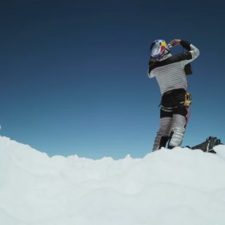
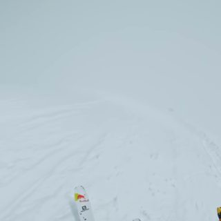
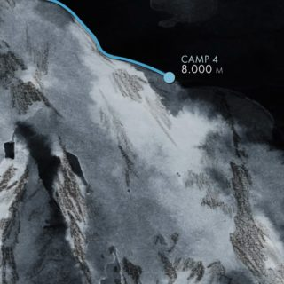
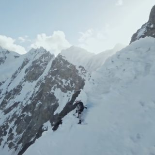
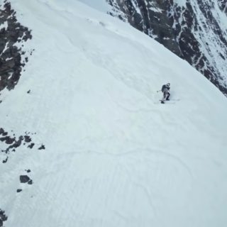

# ten

Open-weight video search for large libraries.

- **Visual embeddings** — [V-JEPA 2](https://huggingface.co/facebook/vjepa2-vitl-fpc16-256-ssv2) (Meta; self-supervised, strong temporal understanding)
- **Captions / summaries** — [Qwen3-VL-8B-Instruct](https://huggingface.co/Qwen/Qwen3-VL-8B-Instruct) (multi-image / video reasoning)
- **ASR transcripts** *(opt-in)* — [Whisper-large-v3](https://huggingface.co/openai/whisper-large-v3) via HF transformers (default) or [faster-whisper](https://github.com/SYSTRAN/faster-whisper)
- **Caption embeddings** — [Qwen3-Embedding-0.6B](https://huggingface.co/Qwen/Qwen3-Embedding-0.6B)
- **Audio embeddings** *(opt-in)* — [LAION CLAP](https://huggingface.co/laion/clap-htsat-fused), used as a bounded post-fusion reranker
- **Vector index** — Qdrant, 2–3 collections; text+visual RRF-fused at query time, audio reranks the head
- **API + UI** — FastAPI + Next.js 15
- **CLI** — `ten`

> **Status: personal experiment.** Exploring what video search looks like end-to-end with current open-weight models. APIs may change without notice. No support promises.

## Install — CLI only

For read-only use of the CLI against a Qdrant (and optionally vLLM) you already have running — yours on another box, a colleague's, etc. Skip to [Quickstart](#quickstart) if you want to run the full stack locally.

```bash
git clone https://github.com/superpan/ten.git
cd ten
uv tool install .                                 # installs `ten` globally

# point at the right services; localhost defaults work if the stack is local
export TEN_QDRANT_URL=http://your-host:6333
# optional: route captions/summaries through a remote vLLM
export TEN_VLM_BACKEND=vllm
export TEN_VLLM_URL=http://your-host:8000/v1

ten search "a dragon breathing fire"              # works from any directory
ten clip <id>
ten summary <id> -d narrative
```

Thumbnail cache defaults to `~/.local/share/ten` (XDG-style), so it doesn't depend on cwd.

Upgrade: `uv tool install --reinstall .`. Uninstall: `uv tool uninstall ten`.

## Quickstart

Run the full stack locally. Roughly 10 minutes of human time + 30 minutes of model-download + ingest time, on a single CUDA GPU with ≥24 GB VRAM. Hand-built smoke set is 4 public-domain videos (~1.5 GB).

```bash
make ffmpeg                              # one-time, requires sudo
make bootstrap                           # uv sync + pnpm install + install-pc
make qdrant-up                           # Qdrant via Docker

make fetch-smoke                         # 4 PD videos -> ./videos/smoke (~1.5 GB)
make ui-build                            # Next.js static export -> ui/out
make index FOLDER=./videos/smoke         # first run downloads ~20 GB of weights
                                         # then ingests 337 clips in ~32 min

make search Q="a dragon breathing fire"  # CLI search
make serve                               # http://127.0.0.1:8765 (api + UI)
```

### Example results

Smoke run over Big Buck Bunny, Sintel, Sintel trailer, and Charlie Chaplin's *The Vagabond* (1916):

| query | top match |
|---|---|
| "a white rabbit in a forest" | `BigBuckBunny.mov` 7:48–7:58 — *"A white rabbit with long ears and a pink nose peeks out from under a large tree…"* |
| "a dragon breathing fire" | `Sintel.mkv` 5:24–5:34 — *"A young girl looks up in shock as a large, dark dragon with outstretched wings soars overhead…"* |
| "a man playing a violin" | `ChaplinVagabond.mp4` 1:39–1:49 — *"A man in a dark suit and bowler hat stands in a doorway, holding a violin and bow…"* |
| "sword fight in a desert canyon" | `Sintel.mkv` 6:27–6:37 — *"A warrior in armor battles a skeletal horse-like creature in a rocky canyon, swinging a weapon…"* |

All 7 queries from the smoke test returned a top hit from the correct source video.

### Long-form: snowsports

A single 12-minute video — Andrzej Bargiel's [first ski descent of K2](https://commons.wikimedia.org/wiki/File:Experience_the_world's_first_ski_descent_of_K2_with_Andrzej_Bargiel.webm) (Red Bull Snow, CC BY 3.0) — ingested as ~80 ten-second clips alongside the existing ~3,100-clip index (MSR-VTT 1K-A + QVH pilot + smoke set). Each row below shows the top hit *across the full index*, not within the snowsports video alone, so the rank reflects actual selection pressure.

A 15-second highlight reel of the five matched moments (3 s each, in chronological order — helmet → wind → summit → ridge → carving):

<video src="data/snowsports_demo/highlights.mp4" controls width="640" poster="data/snowsports_demo/summit.jpg">
  Your browser does not support inline video. Direct link:
  <a href="data/snowsports_demo/highlights.mp4">highlights.mp4</a>
</video>

The thumbnails below are the real per-clip frames that ten caches at ingest, and the caption next to each is exactly what Qwen3-VL wrote — no post-hoc curation:

| scene (mid-frame) | query → matched moment + extracted caption |
|---|---|
|  | **"close-up of a skier in helmet and goggles"** → 0:18–0:28 — *"A skier in a Red Bull helmet and sunglasses takes a selfie at the summit, then turns to prepare for a descent…"* |
|  | **"wind blowing over high snowy terrain"** → 1:39–1:49 — *"A climber in a red jacket and backpack ascends a snowy slope… roped to another climber further up the mountain."* |
|  | **"dramatic view of jagged mountain peaks above clouds"** → 2:33–2:43 — *"A snow-capped mountain peak emerging from a thick layer of clouds against a clear blue sky…"* |
|  | **"a skier navigating a narrow icy ridge"** → 9:18–9:28 — *"A skier descends a steep, snow-covered mountain slope, navigating between exposed rock faces and deep powder…"* &nbsp;_(top result lifted by the CLAP audio reranker — `sources=['text','audio']`)_ |
|  | **"a skier carving turns down a steep snowy face"** → 10:03–10:13 — *"A skier descends a steep, snow-covered mountainside, carving turns down the slope as the camera follows their progress."* |

All five queries surfaced the right K2 clip at rank 1–2 despite competing against ~3,100 unrelated clips. ASR on this footage is mostly garbled because Whisper hallucinates over wind and music — caption text and visual embeddings did the work.

The thumbnails above and the caption text are exactly what ten extracted at ingest time and stored in Qdrant payload — no post-hoc curation. Each scene's full 10-second window can be played back from the API (`/clip/<clip_id>.mp4` Range-streams it on demand) or from the UI by clicking the card.

> Video credit: Red Bull Snow / Andrzej Bargiel, "Experience the world's first ski descent of K2", CC BY 3.0. Source: [Wikimedia Commons](https://commons.wikimedia.org/wiki/File:Experience_the_world's_first_ski_descent_of_K2_with_Andrzej_Bargiel.webm).

### Benchmark — MSR-VTT 1K-A

Text → video retrieval over the standard 1000-video test split. Two operating points:

| config | Recall@1 | Recall@5 | Recall@10 | Median | added cost |
|---|---:|---:|---:|---:|---|
| visual-only, no rerank (baseline) | 0.338 | 0.559 | 0.651 | 4 | — |
| **+ ASR + rerank (best)** | **0.360** | **0.569** | **0.660** | **3** | ~2× ingest, ~1 s query |


Both above frozen CLIP-ViT/L (~0.32), below dedicated end-to-end video-text models (0.43–0.55) — about what you'd expect for caption-mediated retrieval. Methodology, full 2×2 ablation, and how to reproduce: [EVAL.md](EVAL.md).

## When ten fits

**Well-suited:**
- Mid-length to long-form libraries (a few minutes to hours): vlogs, lectures, podcasts, tutorials, demos, sports broadcasts, family/travel footage. The 10 s clip windowing + moment-retrieval UI is designed for "*where* in this video did X happen?"
- Visually distinctive content. V-JEPA + Qwen3-VL describe what's visible — that's the strong axis.
- Speech-bearing content with `--asr` on. Transcripts get appended to caption text, so "when did they mention …" queries work cleanly.
- Short web clips (MSR-VTT-style 10–30 s): solid retrieval at R@1=0.36 on 1K-A.

**Known weak spots:**
- *Visually uniform footage* (single-speaker lectures, security cams, sports replays from one camera angle): V-JEPA can't differentiate, retrieval collapses onto the transcript text. If there's no speech either, no signal.
- *Sub-10 s precision*: clip granularity is the floor. Lower `TEN_CLIP_SECONDS` and re-ingest if you need tighter moment localization.
- *Pure-audio queries* ("applause", "drum solo", "engine revving"): CLAP runs only as a bounded reranker on the head, not a primary retrieval channel. Naive equal-weight RRF integration regressed retrieval in our QVHighlights pilot (R@1 0.68 → 0.21), so CLAP is opt-in and intentionally conservative. A dedicated `/search-audio` endpoint would unlock pure-audio queries.
- *Very long single-take videos*: each 10 s chunk is captioned in isolation; "what happens first, then, finally" queries don't aggregate across the video.
- *Non-English audio* without `TEN_ASR_LANGUAGE` set: Whisper auto-detect is unreliable on short clips.
- *Music libraries by song/artist*: no acoustic fingerprinting. CLAP matches semantics ("rock with heavy guitar") not identity ("track X by artist Y").

## How it works

1. **Index.** Each video is split into overlapping ~10 s clips. For every clip:
   - **V-JEPA 2** produces a normalized visual vector (mean-pooled tokens).
   - **Qwen3-VL** writes a 1–2 sentence caption.
   - **Qwen3-Embedding** embeds the caption.
   - Both vectors land in Qdrant under the same clip id, and a JPEG thumbnail is cached.
2. **Search.**
   - **Text** → caption-vector search.
   - **Image / video** → V-JEPA visual search.
   - Combine both → reciprocal-rank fusion.
3. **Summarize on demand.** The "summarize" button (and `ten summary <clip_id>`) re-decodes the clip and asks Qwen3-VL for a paragraph-length summary. Cached in memory.

The two-collection layout means a text-aligned video encoder is unnecessary — the LLM does the text alignment by writing captions, and you still get fast vector retrieval at query time.

**ASR — opt-in (and intentionally so).** Run `ten index --asr` (or `make index-asr FOLDER=…`) to add a Whisper transcript per clip. Transcript is appended to the caption before text embedding. Use it when your library is dialogue-heavy and queries reference what is *said*; skip it for visual search of mixed content. On MSR-VTT 1K-A, ASR was a near-zero-sum shuffle (R@1 0.338 → 0.325) — it helps when the query quotes the audio, hurts when the caption is abstract. See [EVAL.md](EVAL.md#asr--voice-tag-retrieval) for the full breakdown.

## Requirements

- NVIDIA GPU, ≥24 GB VRAM recommended (Qwen3-VL-8B in bf16).
- Linux, Python 3.12, [uv](https://docs.astral.sh/uv/), Docker, `ffmpeg`.
- Node 20+ with corepack enabled (`corepack enable`) for the UI — `pnpm` is pinned via `packageManager` in `ui/package.json`.

See [Hardware notes](#hardware-notes) for Blackwell / DGX Spark specifics.

## Development

Run the full stack locally and modify it. The CLI-only install above is enough if you don't need this.

```bash
git clone https://github.com/superpan/ten.git
cd ten
make ffmpeg                                # one-time, requires sudo
make bootstrap                             # uv sync + pnpm install + install-pc
make qdrant-up                             # Qdrant in Docker, stays up across sessions
```

Inner loop:

```bash
make dev                                   # process-compose TUI: API only
make dev-ui                                # process-compose TUI: API + Next dev :3000
make serve-reload                          # API w/ --reload (no TUI)
make ui-dev                                # Next dev w/o API supervision
make ui-build                              # static export -> ui/out
```

Ingesting your own videos:

```bash
make index FOLDER=/path/to/your/videos
```

Ingest is recursive and **resumable** — clip ids are deterministic hashes of `(video_path, t_start, t_end)`, so re-running only embeds new clips. Failures on individual videos don't abort the run.

Other workflows:

```bash
make lint   |   make format                # ruff
make eval                                  # MSR-VTT 1K-A retrieval eval — see EVAL.md
make help                                  # full Makefile menu
```

Direct `uv run ten …` works from anywhere inside the repo; see `uv run ten --help` for the full CLI surface.

## Configuration

All settings are env vars (see `src/ten/config.py`):

| var | default | meaning |
|---|---|---|
| `TEN_DATA_DIR` | `~/.local/share/ten` | Where thumbnails live (XDG-style; set to `.ten` for the old project-relative behavior) |
| `TEN_QDRANT_URL` | `http://localhost:6333` | Qdrant endpoint |
| `TEN_VJEPA_MODEL` | `facebook/vjepa2-vitl-fpc16-256-ssv2` | Visual encoder |
| `TEN_VLM_MODEL` | `Qwen/Qwen3-VL-8B-Instruct` | Captioner / summarizer |
| `TEN_TEXT_EMBED_MODEL` | `Qwen/Qwen3-Embedding-0.6B` | Caption embedder |
| `TEN_ASR_BACKEND` | `none` | `none` / `whisper` (HF transformers) / `fasterwhisper` |
| `TEN_ASR_MODEL` | `large-v3` | Whisper variant — `tiny/base/small/medium/large-v3/large-v3-turbo` or full HF id |
| `TEN_ASR_LANGUAGE` | *(auto)* | Force a language code (`en`, `es`, …) instead of auto-detect |
| `TEN_RERANKER_BACKEND` | `none` | `none` / `crossencoder` — enable Qwen3-Reranker over the bi-encoder's top-K |
| `TEN_RERANKER_MODEL` | `Qwen/Qwen3-Reranker-0.6B` | Cross-encoder model id; works with any sentence-transformers CrossEncoder-compatible model |
| `TEN_RERANKER_TOP_K` | `100` | Bi-encoder candidates to rescore per query. Lower = faster query (try 25 for ~4× speedup) |
| `TEN_CLIP_SECONDS` | `10` | Clip window length |
| `TEN_CLIP_OVERLAP` | `1` | Overlap between adjacent clips |
| `TEN_FRAMES_PER_CLIP` | `8` | Frames sampled per clip (bump to 16 for motion-heavy footage at +~17% ingest cost) |
| `TEN_FRAME_RESIZE` | `256` | Short-side resize before encoding |
| `TEN_DEVICE` | `cuda` | Torch device |
| `TEN_DTYPE` | `bfloat16` | Model dtype |
| `TEN_BATCH_SIZE` | `4` | Clips per ingest batch |

## Hardware notes

- **DGX Spark (Grace Blackwell GB10, aarch64, sm_121):** the project is pinned to the **PyTorch cu129 index** in `pyproject.toml`. cu128 omits `compute_120` PTX, which causes NVRTC to fail with `invalid value for --gpu-architecture` on first kernel JIT.
- **decord is not installed** — no aarch64 wheels. Decoding goes through PyAV, which ships its own bundled libav so it doesn't conflict with a system `ffmpeg`.
- **Qdrant is pinned to 1.12.4** because 1.18+ refuses to load segments written by 1.12. To upgrade Qdrant, do a clean re-index.

## Scaling

For thousands of hours of video, captioning is the throughput bottleneck. Two backends:

| backend | when to use | how |
|---|---|---|
| `transformers` *(default)* | Small/medium libraries, on-demand summaries, zero extra infra. | Loads Qwen3-VL in-process. No env needed. |
| `vllm` | Heavy ingest. ~3–5× faster decode via continuous batching. | Run a vLLM server, then `export TEN_VLM_BACKEND=vllm`. |

### Run vLLM via docker-compose

```bash
# Optional HF token if you've gated any models
export HUGGING_FACE_HUB_TOKEN=hf_...

make vllm-up                                  # docker compose --profile vllm
export TEN_VLM_BACKEND=vllm
make index FOLDER=/path/to/videos
```

vLLM env vars:

| var | default | meaning |
|---|---|---|
| `TEN_VLM_BACKEND` | `transformers` | `transformers` or `vllm` |
| `TEN_VLLM_URL` | `http://localhost:8000/v1` | OpenAI-compatible endpoint |
| `TEN_VLLM_MODEL` | same as `TEN_VLM_MODEL` | Model name as served by vLLM |
| `TEN_VLLM_API_KEY` | `EMPTY` | Bearer token (vLLM doesn't enforce by default) |
| `TEN_VLLM_CONCURRENCY` | `8` | Inflight clip captions; vLLM's continuous batching does the rest |
| `TEN_VLLM_TIMEOUT` | `300` | Per-request client timeout (seconds). Bump higher if you see `ReadTimeout` under heavy concurrency. |

> The vLLM image is pinned to `nvcr.io/nvidia/vllm:25.12.post1-py3` in `docker-compose.yml` — NVIDIA's NGC build, blessed for Blackwell (GB10 / sm_121). The compose `command` starts with `vllm serve …` because the NGC entrypoint is just an env-setup wrapper.

### Other levers

- **Smaller captioner:** `TEN_VLM_MODEL=Qwen/Qwen3-VL-2B-Instruct` for a modest speed-up with quality cost.
- **Sharded ingest:** Python decode is single-threaded per process. For >10k videos, run `make index FOLDER=<subset>` per subset under GNU parallel — deterministic clip ids make it safe.
- **Quantization:** at >1M points, enable Qdrant int8 scalar quantization on the visual collection. ~4× smaller, negligible recall drop.
- **Cold start:** first ingest downloads ~20 GB of weights. Subsequent runs warm up in ~30 s.

## License

MIT — see [LICENSE](LICENSE).
